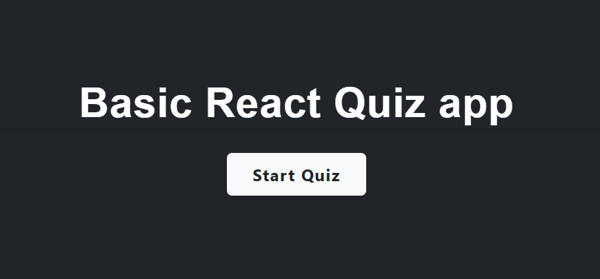
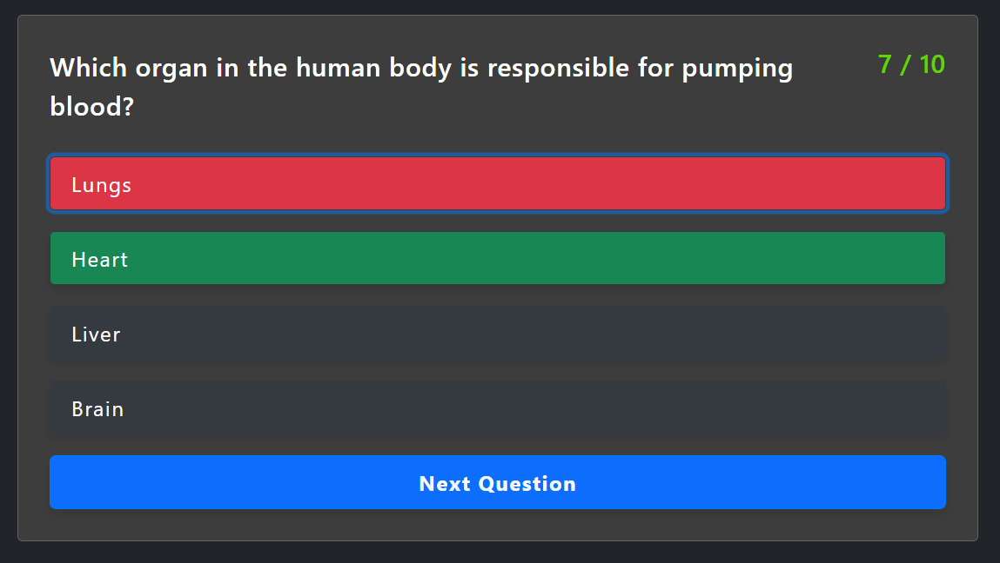
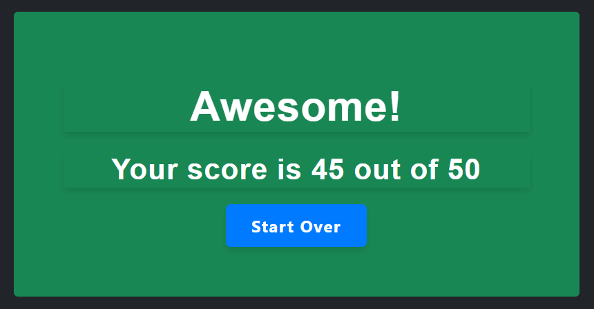

# React Quiz App

A basic multiple-choice quiz application built with **React**, using **JavaScript**, **HTML**, and **CSS**.

## 🚀 Features

- 10-question quiz with one correct answer per question
- Clean and responsive UI
- Simple scoring logic
- Easy to customize and expand

## 🛠 Tech Stack

- React
- JavaScript (ES6+)
- HTML5
- CSS3

## 📸 Screenshots

| Home / Start Screen | Question Screen | Result Screen |
|---------------------|------------------|----------------|
|  |  |  |

## 🔧 Getting Started

To run this app locally:

1. **Clone the repository**

   ```bash
   git clone https://your-repo-url.git
   cd your-project-folder

2. Install dependencies

  ```bash
   npm install

3. Start the development server

     ```bash
   npm start

4. Visit: http://localhost:3000/